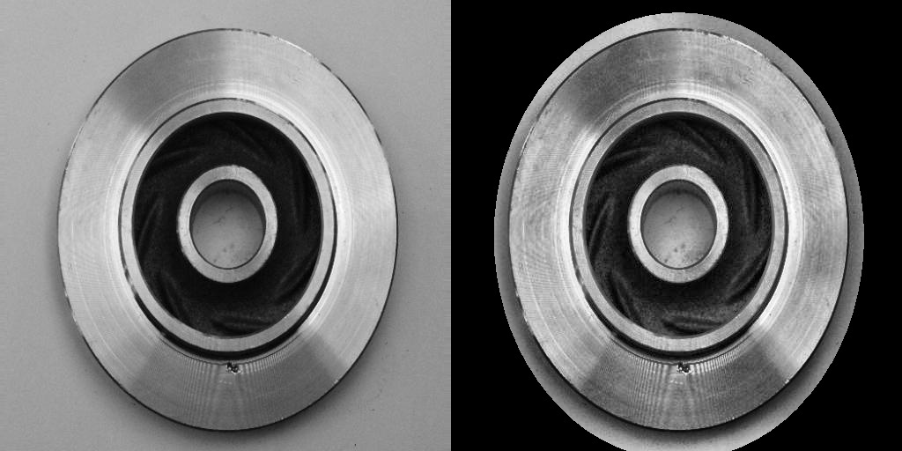

# Casting Defect Detection

This project uses an industrial casting product image dataset to train a deep learning model.
It compares the test results of a model trained on the raw dataset against one trained on the dataset after a custom preprocessing pipeline with OpenCV.

## Prerequisites

- Python 3.12+
- [uv dependency manager](https://docs.astral.sh/uv/getting-started/installation/)

## Installation

### 1. Clone the Repository

```bash
git clone https://github.com/circumflex3105/Casting-Defect-Detection.git
cd Casting-Defect-Detection
```

### 2. Install Dependencies

```bash
uv sync
```

### 3. Setup Dataset

Download the [casting product image data for quality inspection](https://www.kaggle.com/datasets/ravirajsinh45/real-life-industrial-dataset-of-casting-product) Dataset from Kaggle.
Extract the downloaded archive, navigate into `archive/casting_512x512/casting_512x512` and place the two directories `def_front` and `ok_front` into `data/raw` in the project root.

The directory structure should look like this:

```
data/
├── raw/
│   ├── def_front/
│   │   ├── cast_def_0_0.jpeg
│   │   └── ...
│   └── ok_front/
│       ├── cast_ok_0_35.jpeg
│       └── ...
```

## How to Run

The project has a run script that executes the entire pipeline, including dataset splitting, training and evaluation.

```bash
uv run python run.py
```

To use preprocessing, add the `--use-preprocessed` flag.

If you want to go through the pipeline step by step, you can run the individual modules in `src/preprocessing`, `src/model/train.py` and `src/evaluation/metrics.py` directly, for example:

```bash
uv run python -m src.preprocessing.generate_splits
```

## Preprocessing

One of the main goals of this project is to compare the performance of a model trained on the raw dataset against one trained on a preprocessed version of the dataset.
The preprocessing pipeline is implemented in `src/preprocessing` and consists of the following steps:

1. **Dataset Split**: The dataset is shuffeled and split into training, validation, and test sets with a ratio of 70:15:15.
2. **Apply CLAHE**: Contrast Limited Adaptive Histogram Equalization (CLAHE) is applied to enhance the contrast of the images.
3. **Mask Extraction**: A mask is generated for each image to isolate the region of interest. Initial experiments with otsu's thresholding and simple canny edge detection did not yield satisfactory results, so a custom mask with elliptical shape is created based on the known shape of the casting products in the images.

### Visualization

To help improve the preprocessing pipeline, a visualization script is provided in `src/visualization/visualize_preprocessing.py`.
It simply creates a side-by-side comparison of the raw and preprocessed images, saving the output to `data/visualization`.

**Note:** The visualization script will only **merge** the original and preprocessed image, it will not apply the preprocessing steps itself.
Make sure to run the preprocessing pipeline first to generate the preprocessed images before running the visualization script.

The following image shows an example of the side-by-side image comparison of the original (left) and preprocessed (right):


